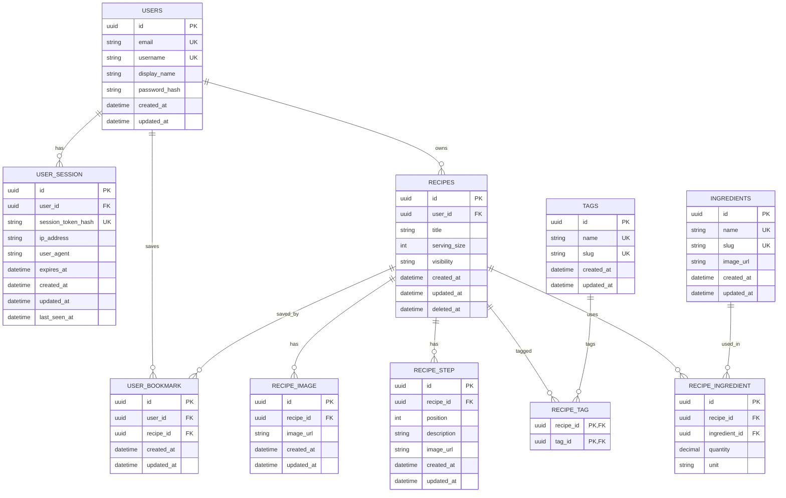

# Recipe Box API


[](https://recipe-box-api-x-azure.vercel.app/)

A REST API for creating, organizing, and sharing recipes, built with **Node.js, Express, TypeScript, Prisma, and PostgreSQL**.

## Overview

People keep recipes scattered across notebooks, photos, and websites, which makes them hard to find again. The Recipe Box API gives users one place to store their recipes, search and filter them, and share the ones they want to make public — while keeping private recipes visible only to their owner.

## Features

- Account creation, login, and logout
- Session-based authentication, with support for staying logged in on multiple devices at once
- Create, edit, and delete your own recipes
- A recipe has a title, ordered steps, ingredients (with quantity and unit), and tags
- Pictures on a recipe, and a picture on each individual step
- Public/private visibility per recipe, enforced everywhere a recipe could surface — search, lists, and direct links
- Guests can browse public recipes without an account
- Search recipes by title or ingredient, and filter by tag
- Save (bookmark) public recipes and manage your saved list
- Soft-delete a recipe to a recoverable trash, with the option to restore it
- View and manage your active login sessions across devices
- Share a public recipe with other people

### Out of Scope for v1

- Folders for organizing saved recipes
- Reports on how often a user cooks a recipe
- Special share cards for social media
- Smart recipe suggestions based on ingredients a user has

## Tech Stack

- Node.js
- Express 5
- TypeScript
- Zod
- Prisma
- PostgreSQL
- Neon
- bcryptjs (password hashing, and session token hashing)
- cookie-parser (reads the session cookie)
- dotenv
- CORS
- pnpm

## Authentication & Sessions

Users log in with an email **or** username (sent as `identifier`) and a password. A successful login issues a random session token, set as an httpOnly cookie (via `cookie-parser`) — there's no JWT involved. The token is hashed with bcrypt and stored as `session_token_hash` on a new `user_session` row, alongside `ip_address`, `user_agent`, and `expires_at`. On every protected route, the incoming cookie is hashed and looked up against that row, which is what makes a session independently listable and revocable per device.

Registering an account does **not** log you in automatically — `POST /api/auth/register` returns `201` with no session cookie set, so the client still needs to call `POST /api/auth/login` afterward.

Because a session belongs to one device, a user can be logged in on several devices at the same time and manage them individually via `GET /api/sessions` and `DELETE /api/sessions/:id`.

Access rules are **ownership-based, not role-based**: any logged-in user can create a recipe, but only the owner can edit, delete, restore, or change the visibility of their own recipe. A public recipe is readable by anyone, including guests with no session. A private recipe is readable only by its owner.

## Access Control (Hard Requirement)

A private recipe must stay invisible to everyone but its owner: it must not appear in search, must not appear in any list, and can't be opened by another user even with a direct link. Because this rule matters everywhere a recipe could surface, it's enforced independently at every layer that can return one — search, lists, and single-recipe lookups — not in one central place.

## API Endpoints

| Method | Path                        | Protected? | Description                                                         |
| ------ | --------------------------- | ---------- | ------------------------------------------------------------------- |
| POST   | `/api/auth/register`        | No         | Create a new account (doesn't log in — call `/api/auth/login` next) |
| POST   | `/api/auth/login`           | No         | Log in with an `identifier` (email or username) and password        |
| GET    | `/api/auth/me`              | Yes        | Get the currently authenticated user                                |
| POST   | `/api/auth/logout`          | Yes        | Log out of the current session                                      |
| GET    | `/api/recipes/mine`         | Yes        | Search and list your own recipes (public and private, not trashed)  |
| GET    | `/api/recipes/mine/:id`     | Yes        | Get one of your own recipes (not trashed)                           |
| GET    | `/api/recipes/trash`        | Yes        | Search and list your trashed recipes                                |
| GET    | `/api/recipes/trash/:id`    | Yes        | Get one of your trashed recipes                                     |
| GET    | `/api/recipes`              | No         | Search and list public recipes                                      |
| GET    | `/api/recipes/random`       | No         | Get a random public recipe                                          |
| GET    | `/api/recipes/:id`          | No         | Get one public recipe                                               |
| POST   | `/api/recipes`              | Yes        | Create a recipe, with its steps, ingredients, tags, and images      |
| PATCH  | `/api/recipes/:id`          | Yes        | Edit a recipe, including its steps, ingredients, tags, and images   |
| DELETE | `/api/recipes/:id`          | Yes        | Permanently delete a recipe                                         |
| PATCH  | `/api/recipes/:id/trash`    | Yes        | Move a recipe to the trash                                          |
| PATCH  | `/api/recipes/:id/restore`  | Yes        | Restore a trashed recipe                                            |
| POST   | `/api/recipes/:id/bookmark` | Yes        | Save a recipe                                                       |
| DELETE | `/api/recipes/:id/bookmark` | Yes        | Remove a saved recipe                                               |
| GET    | `/api/bookmarks`            | Yes        | List your saved recipes                                             |
| GET    | `/api/sessions`             | Yes        | List your active sessions (devices)                                 |
| DELETE | `/api/sessions/:id`         | Yes        | Log out from one specific session                                   |

There's no separate endpoint for images — they travel with the recipe payload. On `PATCH /api/recipes/:id`, `steps`, `ingredients`, `tags`, and `images` are each optional and independent: omit a field and that part of the recipe is untouched; include it and it **replaces** the existing list wholesale — cleared and rebuilt from what you send, not merged, so whatever you send must be the complete list, not just the changed items. `steps`, `ingredients`, and `tags` each require at least one item if you include them at all; `images` has no such minimum, so it's the only one of the four you can send as an empty array to clear it out entirely.

### Recipe response shapes

List endpoints (`/api/recipes`, `/api/recipes/mine`, `/api/recipes/trash`) return a slim item, not the full recipe:

```json
{
  "id": "string",
  "ownerId": "string",
  "title": "string",
  "servingSize": 4,
  "visibility": "public",
  "createdAt": "string",
  "user": { "id": "string", "username": "string", "displayName": "string | null" },
  "coverImage": { "id": "string", "imageUrl": "string" },
  "tags": [{ "id": "string", "name": "string", "slug": "string" }]
}
```

The single-recipe endpoints (`/api/recipes/:id`, `/api/recipes/mine/:id`, `/api/recipes/trash/:id`) return the full recipe instead: everything above except `coverImage`, plus `updatedAt`, the complete `images` array, `ingredients`, and `steps`. Two things worth knowing about these shapes:

- The embedded `user` object never includes `email` — not even on your own recipe.
- Image fields aren't named consistently: the top-level `images` array and list-item `coverImage` use `imageUrl`, but each ingredient's and step's picture is keyed `image` instead.

## Query Parameters

`GET /api/recipes`, `GET /api/recipes/mine`, and `GET /api/recipes/trash` all support:

| Parameter     | Description                                                        | Default     |
| ------------- | ------------------------------------------------------------------ | ----------- |
| `search`      | Search by recipe title (max 100 chars)                             | None        |
| `ingredients` | Filter by ingredient name(s), comma-separated — **all must match** | None        |
| `tags`        | Filter by tag(s), comma-separated — **any must match**             | None        |
| `sortBy`      | `title` \| `createdAt` \| `servingSize`                            | `createdAt` |
| `order`       | `asc` \| `desc`                                                    | `desc`      |
| `page`        | Page number (min 1)                                                | `1`         |
| `limit`       | Recipes per page (1–100)                                           | `10`        |

Filters can be combined with each other, with `search`, and with pagination. Note the different match logic: a recipe must contain _every_ listed ingredient, but only _any one_ of the listed tags.

## Example Requests

### Register

```http
POST http://localhost:3000/api/auth/register
Content-Type: application/json

{
  "email": "muhammed@example.com",
  "password": "password",
  "username": "x14Kernal",
  "displayName": "Muhammed Ahmed"
}
```

### Log in

```http
POST http://localhost:3000/api/auth/login
Content-Type: application/json

{
  "identifier": "muhammed@example.com",
  "password": "password"
}
```

`identifier` accepts either the account's email or its username.

### Create a recipe

```http
POST http://localhost:3000/api/recipes
Content-Type: application/json

{
  "title": "Creamy Garlic Chicken",
  "servingSize": 4,
  "visibility": "public",
  "images": [{ "imageUrl": "https://example.com/images/creamy-garlic-chicken.jpg" }],
  "steps": [
    { "description": "Cut the chicken breast into bite-sized pieces.", "image": null }
  ],
  "ingredients": [
    { "name": "Chicken Breast", "image": null, "quantity": 500, "unit": "g" }
  ],
  "tags": [{ "name": "Dinner" }]
}
```

Each ingredient or tag can either create a new dictionary entry (as above, via `name`) or link an existing one by passing its `id` instead.

The full set of example requests — including trash/restore, bookmarks, sessions, and every search/filter combination — lives in [`requests`](./requests).

## Response Envelope

Every response follows the same shape. `success` tells you which other field to expect: `data` when `true`, or `error` when `false` — never both. `meta` is always present alongside `data`: `{}` for a single resource, or `{ page, limit, total, prev, next }` for a paginated collection.

```json
// Success
{ "success": true, "data": {}, "meta": {} }

// Success — collection
{ "success": true, "data": [], "meta": {} }

// Success — DELETE (data is null; the success flag alone confirms it)
{ "success": true, "data": null, "meta": {} }

// Error
{
  "success": false,
  "error": { "code": "NOT_FOUND", "message": "Recipe not found", "details": null }
}
```

`details` can carry a structured list for validation failures:

```json
{
  "success": false,
  "error": {
    "code": "VALIDATION_ERROR",
    "message": "The request contains invalid fields.",
    "details": [
      { "field": "email", "message": "Invalid email address" },
      { "field": "password", "message": "Password is required" }
    ]
  }
}
```

Every controller sends its response through one of four helpers, so the shape can't drift between endpoints:

```ts
sendSuccess(res, data);
sendSuccessWithoutData(res);
sendSuccessWithMeta(res, data, meta);
sendError(res, status, message);
```

### Owned resources

A recipe's response includes `ownerId`. The client determines ownership — and whether to show owner-only controls like edit, delete, or change visibility — by comparing `ownerId` against the current user's own `id` (from `GET /api/auth/me`):

```json
{
  "success": true,
  "data": {
    "id": "a8e6c368-b466-4682-8db5-1dd8eca3f800",
    "ownerId": "3f9a1c2e-1111-4b2b-9c3d-0a1b2c3d4e5f",
    "title": "Creamy Garlic Chicken",
    "servingSize": 4,
    "visibility": "public",
    "steps": [],
    "ingredients": [],
    "tags": [],
    "images": []
  },
  "meta": {}
}
```

> This replaces an earlier `isOwner: boolean` field — worth double-checking that `recipe-box-web` compares against `ownerId` now rather than reading a stale `isOwner`.

## Database

PostgreSQL, hosted on Neon, accessed through Prisma. Schema changes live in `prisma/migrations/`; seed data lives in `prisma/seed.ts`.

| Entity             | Notes                                                                                                   |
| ------------------ | ------------------------------------------------------------------------------------------------------- |
| `User`             | Account: `email`, `username`, `display_name`, `password_hash`                                           |
| `UserSession`      | One login on one device: `session_token_hash`, `ip_address`, `user_agent`, `expires_at`, `last_seen_at` |
| `UserBookmark`     | A saved recipe; unique per `(user_id, recipe_id)`                                                       |
| `Recipe`           | Owned by one user: `title`, `serving_size`, `visibility`, `deleted_at` (soft delete)                    |
| `RecipeStep`       | An ordered step; unique per `(recipe_id, position)`; optional `image_url`                               |
| `RecipeImage`      | A recipe photo; no ordering field yet — a known gap from the ERD review                                 |
| `Ingredient`       | Shared dictionary entry, not owned by one recipe; unique `name` / `slug`                                |
| `RecipeIngredient` | Recipe ↔ Ingredient link carrying `quantity` and `unit`; unique per `(recipe_id, ingredient_id)`        |
| `Tag`              | Shared label; unique `name` / `slug`                                                                    |
| `RecipeTag`        | Recipe ↔ Tag link; unique per `(recipe_id, tag_id)`                                                     |



### Data integrity rules

- Every recipe requires an owner (`recipes.user_id`).
- Soft-deleting a recipe cascades to its steps, images, and ingredient/tag links — but not to the shared `Ingredient`/`Tag` rows themselves, since other recipes may still reference them.
- A recipe can't list the same ingredient or tag twice, and a user can't bookmark the same recipe twice.
- A visibility change takes effect immediately: once a recipe is private, it disappears from search and from every list but the owner's — even if someone else had already bookmarked it (the bookmark stays, but they can no longer open the recipe).
- A trashed recipe is visible only to its owner, in the trash, until it's permanently deleted after the recovery window.

## Backend Architecture

```text
routes/  →  controllers/  →  services/  →  repos/
```

- **routes** — maps one URL and HTTP method to one controller function. No business logic.
- **controllers** — validates the request, calls the right service, and sends the response via `sendSuccess`/`sendError`. Never touches the database directly.
- **services** — owns the business rules: ownership, visibility, ingredient scaling, validation. Doesn't know about HTTP.
- **repos** — the only layer that talks to the database.

## Validation and Errors

The API validates input before creating or updating a resource.

| Status | Description                                                                                                                                      |
| ------ | ------------------------------------------------------------------------------------------------------------------------------------------------ |
| `200`  | Request succeeded, including deletes — the response body still confirms it                                                                       |
| `201`  | Resource created                                                                                                                                 |
| `400`  | Invalid request data                                                                                                                             |
| `401`  | Missing or invalid session                                                                                                                       |
| `404`  | Resource not found, or not visible to the current user — a private or unowned recipe resolves to `404`, not `403`, so its existence isn't leaked |
| `409`  | Conflict — e.g. bookmarking a recipe you've already saved                                                                                        |

## Environment Variables

Create a `.env` file in the project root:

```env
PORT=3000
NODE_ENV="development" | "production"
DATABASE_URL="your-neon-pooled-connection-string"
```

No signing secret is needed. The session cookie holds a random token; on login it's hashed with bcrypt and stored as `session_token_hash` on a new `user_session` row, then re-hashed and looked up on every protected request. Deleting that row (via `DELETE /api/sessions/:id` or logout) is what revokes a device's session — independent of any token expiry.

Do not commit `.env` to Git.

## Run the Project Locally

### 1. Clone the repository

```bash
git clone https://github.com/x14kernal/recipe-box-api
cd recipe-box-api
```

### 2. Install dependencies

```bash
pnpm install
```

### 3. Configure environment variables

Check `.env.example`, then create your own `.env` (see [Environment Variables](#environment-variables) above).

### 4. Set up the database

```bash
pnpm prisma migrate dev
pnpm prisma generate
pnpm prisma db seed
```

To inspect the database locally:

```bash
pnpm prisma studio
```

### 5. Start the server

```bash
pnpm dev
```

The API runs at `http://localhost:3000`. Once it's up, [`requests`](./requests) walks through the full flow — register, log in, browse and manage recipes, bookmarks, sessions, and trash/restore.

## Definition of Done

- [x] Users can create an account, log in, and log out.
- [x] Users can create, edit, and delete only their own recipes.
- [x] Users can add ingredients, steps, tags, and pictures to a recipe.
- [x] Guests can see public recipes.
- [x] Only the owner can see a private recipe.
- [x] Users can search recipes by title and ingredient. Users can filter recipes by tag.
- [ ] Ingredient amounts change correctly when the recipe size changes.
- [x] A user cannot bookmark the same recipe two times.
- [x] Users can see and remove their bookmarked recipes.
- [x] Users can get a deleted recipe back. This works only for a short time after delete.
- [x] Users can see and manage their active sessions.
- [x] Every API answer has the same shape.
