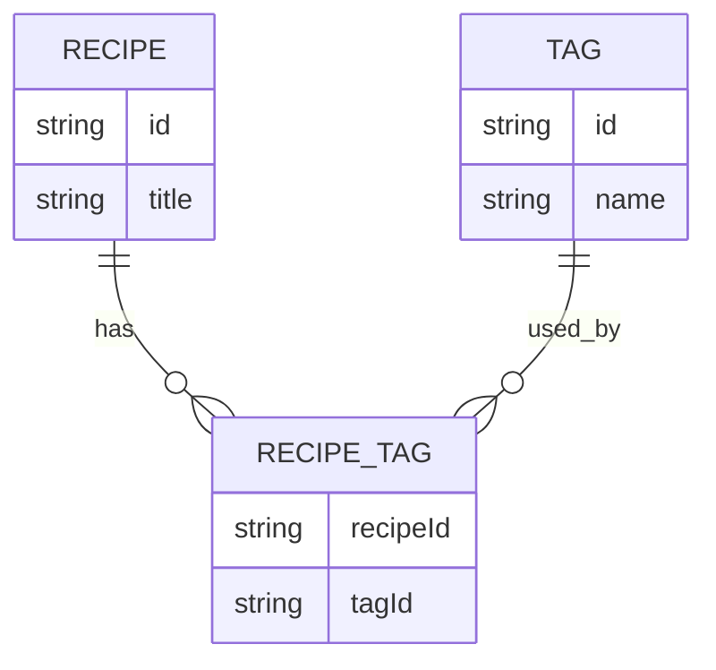

# Project brief

## Recipe Box API v1

**Problem it solves:** lets someone store, organize, and search their own recipes through a clean API — the foundation for a bigger app you'll build across the next 3 phases.

**Must-have features:**

1. List all recipes (`GET /api/recipes`).
2. Get one recipe by ID (`GET /api/recipes/:id`).
3. Create a recipe, with validation (`POST /api/recipes`).
4. Update a recipe (`PUT /api/recipes/:id`).
5. Delete a recipe (`DELETE /api/recipes/:id`).
6. Filter recipes by tag using a query parameter.
7. Data survives a server restart (saved to a JSON file).
8. Bad input is rejected with a clear `400` error, not a crash.

**Nice-to-have features:**

- A random-recipe endpoint.
- Search by ingredient name.
- Pagination on the list endpoint.

**Route outline:**

| Method | Path               | Description                         |
| ------ | ------------------ | ----------------------------------- |
| GET    | `/api/recipes`     | List all recipes (supports `?tag=`) |
| GET    | `/api/recipes/:id` | Get one recipe                      |
| POST   | `/api/recipes`     | Create a recipe                     |
| PUT    | `/api/recipes/:id` | Update a recipe                     |
| DELETE | `/api/recipes/:id` | Delete a recipe                     |

**Data shape:**

```ts
interface Recipe {
  id: string;
  title: string;
  ingredients: string[];
  steps: string[];
  tags: string[];
}
```

**Definition of Done:**

- [x] All 5 core routes work and return the correct status codes.
- [x] Invalid input (e.g. missing title) returns a `400`, not a crash.
- [x] Requesting a recipe ID that doesn't exist returns a `404`, not a crash or a `200` with empty data.
- [x] Data survives a server restart.
- [x] `.env` is used for configuration and is not committed to Git.
- [~] API is deployed and reachable at a public URL.
- [x] README lists every endpoint with an example request.

## Recipe Box API v2

**Problem it solves:** the same recipe tool as v1, but now the data is stored in a real, structured PostgreSQL database instead of a JSON file. Tags are stored consistently, and the relational design prepares the project for real user accounts in Phase 4.

**Must-have features:**

1. `User`, `Recipe`, `Tag`, and `RecipeTag` exist as real PostgreSQL tables.
2. The relational database is designed by hand before using Prisma.
3. The initial database schema is created using raw SQL.
4. A `User` can have many `Recipe` records through `Recipe.userId`.
5. A `Recipe` can have many `Tag` records, and a `Tag` can belong to many recipes through the `RecipeTag` join table.
6. Existing tag names are reused instead of creating duplicate tags.
7. New tag names create new tags.
8. The JSON-file data layer is replaced with Prisma and PostgreSQL.
9. Prisma migrations are used to manage database schema changes.
10. An index exists on `Recipe.userId`.
11. All existing Phase 2 API functionality continues to work correctly against the PostgreSQL database:
    - CRUD operations.
    - Tag filtering.
    - Ingredient search.
    - Pagination.
    - Random recipe.

**Relational model:**

```text
User (1) ─────< Recipe (many)

Recipe (many) ─────< RecipeTag >───── Tag (many)
```

### Entities

```text
User
- id
- email
- passwordHash
- createdAt

Recipe
- id
- title
- ingredients
- steps
- createdAt
- userId

Tag
- id
- name

RecipeTag
- recipeId
- tagId
```

### Definition of Done

- [x] ER diagram is created and saved in docs/er-diagram.png.
- [x] The relational design correctly represents User → Recipe as one-to-many.
- [x] The relational design correctly represents Recipe ↔ Tag as many-to-many through RecipeTag.
- [x] The reason for using a separate Tag table is documented in docs/brief.md.
- [ ] PostgreSQL contains the required users, recipes, tags, and recipe_tags tables.
- [ ] I can write a basic SELECT query with WHERE, ORDER BY, and LIMIT from memory.
- [ ] I can write a basic JOIN query from memory.
- [ ] I can write a GROUP BY query with an aggregate function such as COUNT.
- [ ] I have used EXPLAIN or EXPLAIN ANALYZE and can explain what an index changes.
- [ ] prisma/schema.prisma matches the relational design.
- [ ] At least one Prisma migration exists in prisma/migrations/ and is committed to Git.
- [ ] A seed script creates connected sample data.
- [ ] The API uses Prisma instead of the JSON-file storage layer.
- [ ] `recipes.json` and the old file-based storage functions are removed.
- [ ] All Phase 2 API functionality works correctly against PostgreSQL.
- [ ] The same tag used by multiple recipes is stored only once in the Tag table.
- [ ] An index exists on Recipe.userId.
- [ ] README is updated with the PostgreSQL, Prisma, and database setup instructions.
- [ ] The deployed API's writes are verified to persist correctly with the real database.

### Notes

#### Why use a separate Tag table?

Because many recipes can use the same tag.

Instead of storing:

```text
Recipe
- tags: ["vegan", "quick"]
```

we store tags separately:



> We use a separate Tag table so tags can be reused consistently across many recipes, with RecipeTag connecting recipes and tags.
