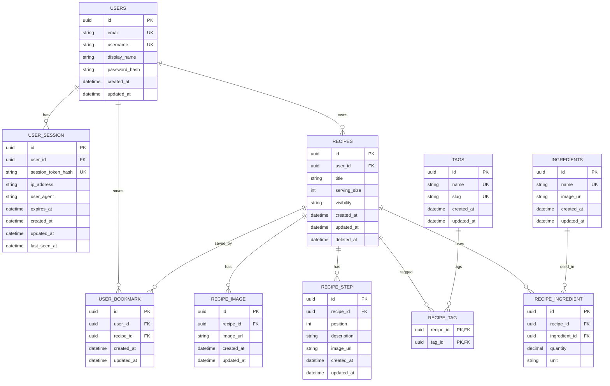

# Recipe App — Requirements Brief

## Problem

People keep recipes in many places. Some are in notebooks. Some are photos. Some are on websites. It is hard to find them again.

The Recipe App gives users one place for their recipes. Users can create recipes, edit recipes, and find recipes. Users can also share recipes with other people.

## Must-have Features

1. Users can create an account. Users can log in and log out.
2. Users can create, edit, and delete their own recipes.
3. A recipe has a title, a description, ingredients, and steps. The steps are in order.
4. Users can add pictures to a recipe. Users can add a picture to each step.
5. Users can add tags to a recipe.
6. Users can make a recipe public or private.
7. Guests can look at public recipes. Guests do not need an account.
8. Users can search recipes by title. Users can search recipes by ingredient.
9. Users can filter recipes by tag.
10. Users can change the recipe size. The app changes the ingredient amounts too.
11. Users can save a public recipe. Users can remove a saved recipe.
12. Users can see their saved recipes.
13. Users can see recipes they deleted. Users can get a deleted recipe back.
14. Users can log in on many devices at the same time. Users can see and manage these devices.
15. Users can share a public recipe with other people.

## Out of Scope for v1

We will not build these features now:

- Folders for saved recipes
- Reports about how often a user cooks a recipe
- Special share cards for social media
- Smart recipe suggestions based on ingredients a user has

## Definition of Done

- [ ] Users can create an account, log in, and log out.
- [ ] Users can create, edit, and delete only their own recipes.
- [ ] Users can add ingredients, steps, tags, and pictures to a recipe.
- [ ] Guests can see public recipes.
- [ ] Only the owner can see a private recipe.
- [ ] Users can search recipes by title and ingredient. Users can filter recipes by tag.
- [ ] Ingredient amounts change correctly when the recipe size changes.
- [ ] A user cannot save the same recipe two times.
- [ ] Users can see and remove their saved recipes.
- [ ] Users can get a deleted recipe back. This works only for a short time after delete.
- [ ] Users can see and manage their active sessions.
- [ ] Every API answer has the same shape.

## Hard Requirement

### Recipe Ownership and Visibility

Only the right person can see or change a recipe. This rule is important.

This is hard because every part of the app must check the rule. This means search, lists, and single recipe pages all need the check — not just one place.

A private recipe must stay hidden from other users. It must not appear in search. It must not appear in any list. Other users cannot open it, even with a direct link.

## Entities & Relationships



- **User** — an account. Fields: `email`, `username`, `display_name`, `hashed_password`. One user can have many recipes, many sessions, and many bookmarks.
- **Session** (`user_session`) — one login on one device. Fields: `session_token_hash`, `expires_at`, `last_seen_at`, `ip_address`, `user_agent`. One session belongs to one user.
- **Recipe** — belongs to one user (the owner). Fields: `title`, `visibility`, `status`, `serving_size`, `deleted_at`. `deleted_at` marks a soft delete. One recipe can have many steps, many images, and many bookmarks. A recipe can also have many ingredients and many tags.
- **Recipe Step** (`recipe_step`) — belongs to one recipe. Fields: `position`, `description`, optional `image_url`. `(recipe_id, position)` is unique, so every step has one clear place in the order.
- **Recipe Image** (`recipe_image`) — belongs to one recipe. Field: `image_url`. There is no `position` field yet, so images have no fixed order right now (a known gap from the ERD review).
- **Ingredient** — a shared item, not owned by one recipe. Fields: `name` (unique), `image_url`. Many recipes can use the same ingredient.
- **Recipe Ingredient** (`recipe_ingredient`) — connects a recipe and an ingredient. Fields: `quantity`, `unit`. `(recipe_id, ingredient_id)` is unique.
- **Tag** — a shared label. Fields: `name`, `slug`. Many recipes can use the same tag.
- **Recipe Tag** (`recipe_tag`) — connects a recipe and a tag. `(recipe_id, tag_id)` is unique.
- **Bookmark** (`user_bookmark`) — connects a user and a recipe they saved. `(recipe_id, user_id)` is unique.

In short: one user has many recipes, sessions, and bookmarks. One recipe has many steps and images. A recipe connects to many ingredients and many tags through the connector tables above.

## Data Integrity

- Every recipe must have one owner. The field `recipes.user_id` is required.
- Steps, images, and the recipe's ingredient and tag links all belong to one recipe. When a recipe is soft-deleted, these are deleted too.
- Ingredients and tags are shared. When a recipe is soft-deleted, only its links (`recipe_ingredient`, `recipe_tag`) are deleted. The ingredient or tag itself stays, because other recipes may still use it.
- `(recipe_id, position)` is unique for steps. Two steps in the same recipe cannot have the same position.
- `(recipe_id, ingredient_id)` is unique. `(recipe_id, tag_id)` is unique. A recipe cannot list the same ingredient or tag two times.
- `(recipe_id, user_id)` is unique for bookmarks. A user cannot save the same recipe two times.
- `ingredients.name` and `tags.name` are unique. The same ingredient or tag is never saved as two different rows.
- A visibility change happens right away. Once a recipe is private, it stops showing in search and stops showing to anyone but the owner. If someone else already bookmarked it, the bookmark stays, but they can no longer open the recipe.
- A soft-deleted recipe is hidden from normal use. Only the owner can see it, in the trash, until it is deleted for good after the recovery time.
- A private recipe never appears in search results or in any list, except for its owner.

## API Surface

| Method | Path                    | Protected? | Description                                                                             |
| ------ | ----------------------- | ---------- | --------------------------------------------------------------------------------------- |
| POST   | `/auth/register`        | No         | Make a new account                                                                      |
| POST   | `/auth/login`           | No         | Log in                                                                                  |
| POST   | `/auth/logout`          | Yes        | Log out                                                                                 |
| GET    | `/recipes`              | No         | Look at and search public recipes                                                       |
| GET    | `/recipes/:id`          | Depends    | Get one recipe. Everyone can see a public recipe; only the owner can see a private one. |
| POST   | `/recipes`              | Yes        | Make a new recipe, with its steps, ingredients, tags, and images                        |
| PATCH  | `/recipes/:id`          | Yes        | Edit a recipe, including its steps, ingredients, tags, and images                       |
| DELETE | `/recipes/:id`          | Yes        | Delete a recipe                                                                         |
| GET    | `/recipes/mine`         | Yes        | See your own recipes                                                                    |
| GET    | `/recipes/trash`        | Yes        | See your deleted recipes                                                                |
| POST   | `/recipes/:id/restore`  | Yes        | Get a deleted recipe back                                                               |
| POST   | `/recipes/:id/bookmark` | Yes        | Save a recipe                                                                           |
| DELETE | `/recipes/:id/bookmark` | Yes        | Remove a saved recipe                                                                   |
| GET    | `/bookmarks`            | Yes        | See your saved recipes                                                                  |
| GET    | `/sessions`             | Yes        | See your active sessions                                                                |
| DELETE | `/sessions/:id`         | Yes        | Log out from one session                                                                |

There is no separate endpoint for images. Images are part of the recipe data. They go in with `POST /recipes` when a recipe is created, and with `PATCH /recipes/:id` when a recipe is edited.

## Response Envelope

Every API response follows a consistent structure, known as the response envelope.

The `success` field indicates whether the request was successful:

- When `success` is `true`, the response contains a `data` field and optional `meta` information.
- When `success` is `false`, the response contains an `error` object describing the failure.

### Success Response

A successful response contains the requested data. The `data` field may contain either a single object or a collection of objects.

```json
{
  "success": true,
  "data": {},
  "meta": {}
}
```

For collection responses:

```json
{
  "success": true,
  "data": [],
  "meta": {}
}
```

The `meta` field can be used for additional response metadata, such as pagination information.

For `DELETE` requests, `data` is `null` — the `success` flag alone confirms the deletion.

```json
{
  "success": true,
  "data": null,
  "meta": {}
}
```

### Error Response

A failed response contains an `error` object with a machine-readable error code, a human-readable message, and optional additional details.

```json
{
  "success": false,
  "error": {
    "code": "NOT_FOUND",
    "message": "User not found",
    "details": null
  }
}
```

When additional error information is available, `details` can contain a structured object:

```json
{
  "success": false,
  "error": {
    "code": "VALIDATION_ERROR",
    "message": "The request contains invalid fields.",
    "details": {
      "email": "Invalid email address",
      "password": "Password is required"
    }
  }
}
```

### Response Contract

The response envelope follows these rules:

| `success` | `data`      | `meta`      | `error`     |
| --------- | ----------- | ----------- | ----------- |
| `true`    | Required    | Optional    | Not present |
| `false`   | Not present | Not present | Required    |

The `success` field acts as the discriminator between successful and failed responses. A response contains either `data` or `error`, never both.

### Helper Functions

Every controller uses one of these two functions. This keeps the response shape the same everywhere:

```ts
sendSuccess(res, data);
sendError(res, status, message);
```

### Owned Resource Rule

If a user can own something — a recipe or a bookmark — the answer includes `isOwner`. This is `true` or `false`. It tells the app if this user is the owner, so the app knows whether to show buttons like edit, delete, or change visibility.

## Backend Architecture

The app has four layers. Each layer has one job.

```text
routes/
    ↓
controllers/
    ↓
services/
    ↓
repos/
```

## Layer Responsibilities

- routes: connects one URL and one HTTP method to one controller function. No business logic here.
- controllers: reads and checks the request, calls the right service, and sends the answer with `sendSuccess` or `sendError`. It does not touch the database directly.
- services: holds the business rules — who owns a recipe, who can see it, how to scale ingredients, how to check data. It does not know about HTTP.
- repos: the only layer that talks to the database. It gives simple read and write actions to the services. It does not know about HTTP or business rules.

## Authentication & Authorization

Users log in with an email and a password. This starts a session for one device. Every protected route checks this session to know who is asking.

Access rules are based on ownership, not on roles. Any logged-in user can create a recipe. But only the owner can edit, delete, restore, or change the visibility of their own recipe.

Visibility controls who can read a recipe. Everyone can read a public recipe, even guests with no session. Only the owner can read a private recipe.

Every protected route checks two things before it sends any data: who is asking, and — when it matters — whether they own the recipe.
